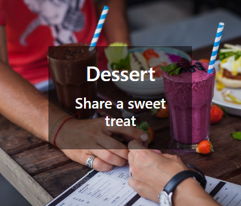
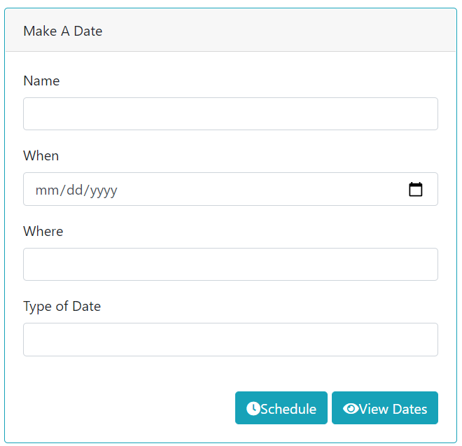

# First_Impression
# Table of Contents
* [Description](#description)
* [User_Story](#user_story)
* [Images](#images)
* [Links](#links)
* [Technology_Used](#technology_used)
* [Contributors](#contributors)

# Description

First Impression helps make planning a get together simpler with providing easy to find choices

# User_Story

There's plenty of ways to find someone to go out with, but what happens after you make that connection? 
Making plans can sometimes be overwhleming, so First Impression has made it easier. Do you want to go to 
dinner, grab a quick coffee, or maybe meet for a sweet treat...or plan a whole evening with all 3? 
First Impression has the best options at your fingertips. Simply login and pick the category you'd like 
to explore first, and start making plans. First Impression includes a database to keep track of your
social events.

# Images

   
   

  
  
   
   

  

   
   

  

   
   

  

   

# Links

GitHub - https://github.com/JoeWills615/First_Impression

Heroku - https://pacific-basin-52237.herokuapp.com/

# Technology_Used

Heroku

JAWSdb

MYSQL

API (Zomato)

Sequelize

ESLint

Handlebars

JavaScript

Jquery

Node

Bootstrap

GitHub

Travis

HTML/CSS

# Contributors
Chris Ferguson (cfergus7)

Joe King (jking0186)

Joe Wills (JoeWills615)

Violet Dreyfuss (DaVioletDeath)
